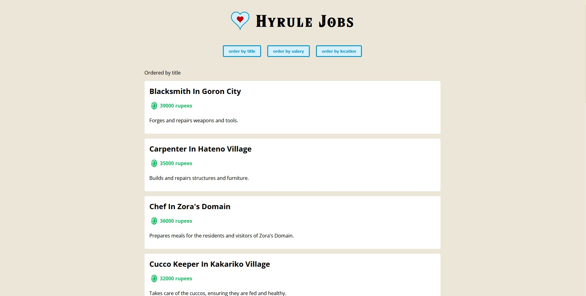

<h1><a href="https://hyrule-jobs-alexandre-gilberts-projects.vercel.app/">Hyrule Job Board
</h1>

## Project setup
```
npm install
```

### Compiles and hot-reloads for development
```
npm run serve
```

### Compiles and minifies for production
```
npm run build
```

### Lints and fixes files
```
npm run lint
```

### Customize configuration
See [Configuration Reference](https://cli.vuejs.org/config/).
